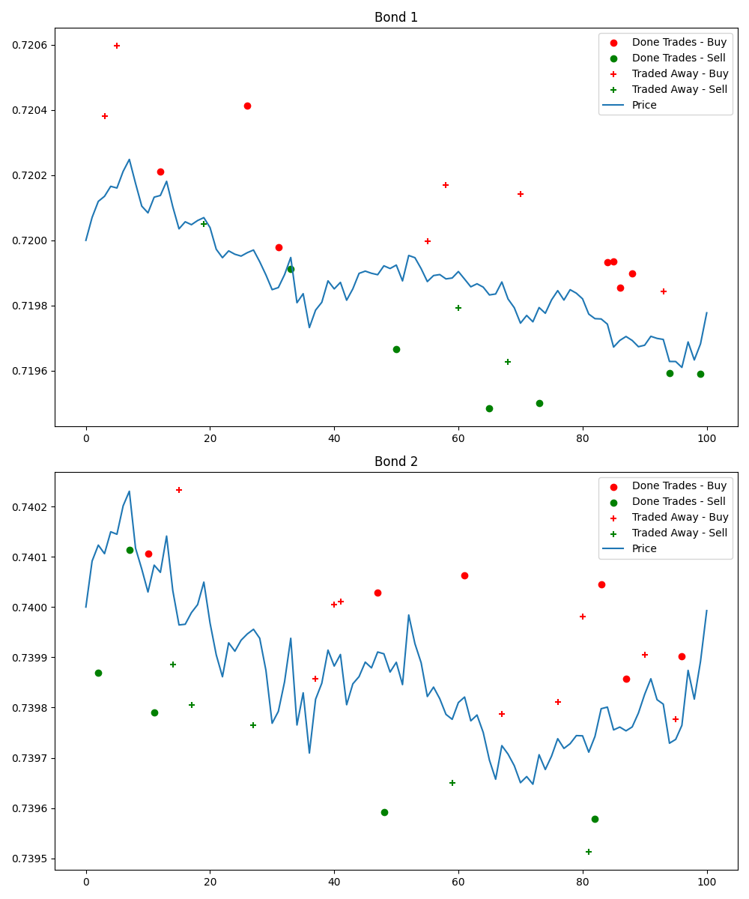
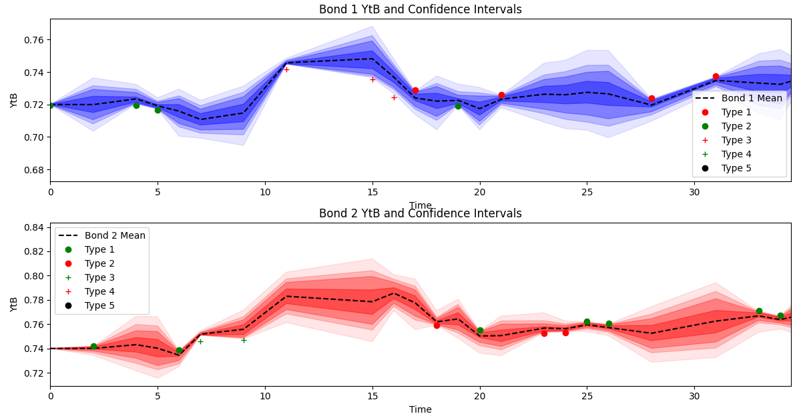

# Hidden Markov Models (HMM) Project

This project was carried out as part of the ENSAE course taught by Nicolas Chopin. It explores the use of Hidden Markov Models (HMMs) and particle filters for mid-price estimation of European corporate bonds. The work is primarily based on the paper:

**Reference**:
- [*Mid-price estimation for European corporate bonds: a particle filtering approach*](https://arxiv.org/abs/1810.05884)

## Project Structure

This project consists of two main files:

1. **Data generation**: This file generates the data required to simulate and analyze the behavior of bonds.
2. **Particle filter**: This file applies the particle filter to estimate the mid-prices.

## Main Results

### Result Graphs

The main results include two graphs illustrating the model's performance:
1. The generation of two correlated bonds.
2. The prediction of mid-YtB of each bond.






## Running the Project

1. Clone the repository:
   ```bash
   git clone <repository_link>
   cd <repository_name>
   ```

2. Run the data generation script:
   ```bash
   python trades_simulation.py
   ```

3. Execute the particle filter script:
   ```bash
   python price_simulation_from trades.py
   ```
